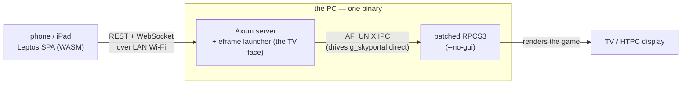

# skylander-portal-controller

My kids love Skylanders, but the save data (your levels, gold and Imaginators) lives ON the figure and keeping a PS3 working is even more difficult. So the portal runs in an emulator (RPCS3) and the kids drive it from a phone over the house Wi-Fi: pick a profile (PIN-gated, anti-sibling), pick a game, tap figures onto the emulated portal. The figure files are per-profile copies on the PC, somewhere a vacuum can't end them.

It boots from Steam Big Picture and puts a QR code on the TV. Phones scan in and SHARE one portal — either kid can touch any slot (co-op, free-for-all), a colour dot per slot showing whose figure is whose.

Higher-level pitch + the demo videos: <https://hotchkiss.io/pages/projects/skylander-portal-controller>. The source-of-truth docs are in the repo: `SPEC.md` (the long-form spec + every decision's Q&A), `PLAN.md` (the execution checklist) and `CLAUDE.md` (the compact working reference). Research writeups under `docs/research/`.

Latest version + the full changelog: the [Releases page](https://github.com/chotchki/skylander-portal-controller/releases) (that's what it's FOR).

## How it fits together



One binary on the PC does two jobs: an Axum web server (serves the phone SPA + the command API) and the eframe launcher window (the QR + status on the TV). It drives a PATCHED RPCS3 over a local AF_UNIX socket — `g_skyportal` control direct, instead of a robot clicking through RPCS3's menus on screen (instant, and it can't fumble a button that moved). The phone stays a dumb client: REST to send a command, a WebSocket to get state back.

## Install (end users)

You bring your own RPCS3 (<https://rpcs3.net>) and your own firmware + `.sky` figure dumps. This ships NO game or firmware content (that's piracy — [dump your own](https://wiki.rpcs3.net/index.php?title=Help:Dumping_PlayStation_3_games)).

1. Install: `winget install ChristopherHotchkiss.SkylanderPortalController`. winget is a trusted authority, so you skip the SmartScreen "unknown publisher" scare and it upgrades cleanly. (Or grab the MSI or portable zip off the [Releases page](https://github.com/chotchki/skylander-portal-controller/releases) — same binary; the MSI installs to Program Files, the zip unpacks anywhere.)
2. Point it at your RPCS3. First launch asks for your RPCS3 path + firmware-pack root and remembers them (`%APPDATA%\skylander-portal-controller\`). It reads firmware + games from your install but drives the portal through its OWN bundled patched RPCS3 — stock RPCS3 doesn't support the level of control we need, which is why the patched build ships alongside.
  - You can also choose here to support a desktop install and control the portal with your desktop only.
3. (Optional) Add it to Steam (Add a Non-Steam Game) so it launches in Big Picture.
4. (Optional) Steam artwork. Non-Steam games show a blank library card. The install drops a first-pass artwork set next to the app in `steam/`; apply it with Steam → right-click → Manage → Set Custom Artwork. Steam won't do it for you, so it's a one-time manual step.

Windows x86_64 is the shipping target (the patched-RPCS3 IPC driver). The macOS build is source only for the moment, a signed build is planned.

## Running in dev

You need a Rust toolchain (with the `wasm32-unknown-unknown` target) and `trunk`. A real portal needs Windows + a real RPCS3; macOS runs the mock driver (set `SKYLANDER_PORTAL_DRIVER=mock` in `.env.dev` — full bringup in `docs/dev/macos-bringup.md`).

1. Copy `.env.dev.example` to `.env.dev`, fill in the RPCS3 + firmware-pack paths.
2. Build the phone SPA: `cd phone && trunk build`.
3. From the repo root: `cargo run`. A windowed launcher comes up with a QR + URL — scan it from a phone on the same LAN, tap a slot, tap a figure, watch it load into the emulated portal.

`SKYLANDER_PORTAL_DRIVER=mock` in `.env.dev` swaps in the in-memory mock (no RPCS3) while you iterate on UI.

### One `cargo` gotcha

`Cargo.toml` sets `default-members = ["crates/server"]`, so a bare `cargo run` / `test` / `build` at the repo root touches ONLY the server crate. That's what lets step 3 work without a `--bin` flag (the workspace also holds a one-shot wiki-scrape tool that would otherwise make `cargo run` ambiguous). The consequence that bit me: a bare `cargo test` skips everything but the server — use `cargo test --workspace` (or `-p <crate>`) to actually exercise the indexer / sky-parser / etc. CI runs `--workspace` on every push, so regressions still get caught, just not by your local `cargo test`.

## Layout

- `crates/core/` — shared domain types + the wire protocol.
- `crates/indexer/` — walks the firmware pack into a figure list.
- `crates/rpcs3-control/` — the `PortalDriver` trait + its impls (IPC for the patched RPCS3, UIA fallback for stock, mock for dev).
- `crates/server/` — the binary (Axum + eframe + the driver worker).
- `phone/` — the Leptos CSR SPA (builds to WASM via trunk).
- `tools/` — one-shot helpers (firmware inventory, UIA probes, the play-through recorder).
- `docs/` — research writeups + aesthetic reference.

## Tests

```
cargo test --workspace                       # unit + integration
SKYLANDER_PACK_ROOT=… cargo test -p skylander-indexer --test real_pack -- --ignored
RPCS3_SKY_TEST_PATH=… cargo test -p skylander-rpcs3-control --test live -- --ignored
```

The `--ignored` ones need a real firmware pack or an interactive RPCS3, so they stay off by default.

## License

GPL-2.0-only (see `LICENSE`). The repo vendors RPCS3 (`vendor/rpcs3`) and carries a patch series against it (`rpcs3-patches/`); RPCS3 is GPLv2, so the patches and the combined work are GPL-2.0 too. 

Skylanders characters, images and trademarks are Activision's. This ships no game or firmware content — you supply your own RPCS3 install and firmware backups.
